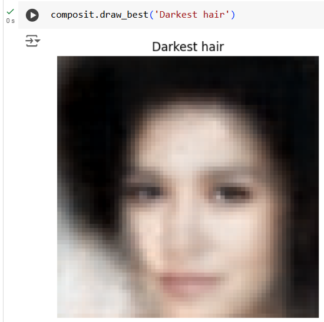

# Bayesian methods for machine learning

Purpose of the project is to use variational autoencoder to create *Facial composites* - a widely used forensics method to generate images of suspects. Random faces are sampled as points in latent low-dimensional space and decoded as face images. A user (a witness) is then asked to assign scores to each generated image. In every further iteration new images are generated so that they maximize their score using scores from prior iterations. This is my solution of the final project of the Bayesian Methods for Machine Learning MOOC course. 

### How to run:

The easiest way is to run on Google Colab

- Open notebook in Google Colab
- Upload utils.py into the session drive
- Run the notebook
- Note that in some parts the notebook expects input from a user (images rating)
